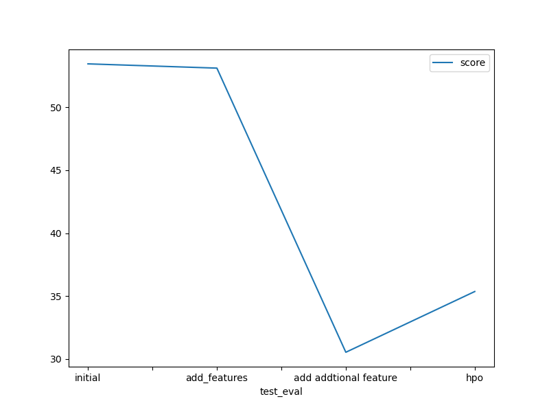
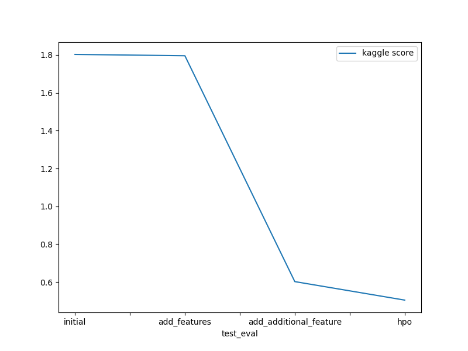

# Report: Predict Bike Sharing Demand with AutoGluon Solution
#### Harish Kumaravel

## Initial Training
### What did you realize when you tried to submit your predictions? What changes were needed to the output of the predictor to submit your results?
Initially when submitting the predictions, I noticed that the some predictions were negative values and Kaggle does not allow such values.
To fix this issue I used a function that clips the negative values to zero which then enabled me to submit them.

### What was the top ranked model that performed?
The top ranked model was the WeightedEnsemble_L3. This model combines scores from different base models such as XGBoost or LGBM

## Exploratory data analysis and feature creation
### What did the exploratory analysis find and how did you add additional features?
The EDA showed that some features could be combined or separated. I saw that there could be a correlation between
the humidity and temperature and created a new feature called the 'Temperature - Humidity Index', this could help identify
hot humid days where people may not want to be cycling.

I also separated the datetime into hours and months to allow better precision in looking at how the time affects the performance,
the hour could provide more insights as to how the time of day impacts when people rent a bike

### How much better did your model perform after adding additional features and why do you think that is?
Adding the 'Temperature0-Humidity Index' did not improve the model very much. This could be because it is highly correlated to the existing
temperature and humidity data so adds little extra value.

WHen creating the hour and month feature, this significantly improved the model as it was now able to take the time of day and month into account when
making the predictions, which it did not have clear data for before this.

## Hyper parameter tuning
### How much better did your model preform after trying different hyper parameters?
To perform the hyperparameter tuning, I started by understanding that the best performing model was the ensemble. I then decided to focus on one of the base models this uses, I
noticed that the best base model is the LGBM so I focussed on providing hyperparemeters that can improve its performance.

I started by reducing the learning rate to 0.05, this reduces the speed of the changes that the model can make when training to allow better generalisation.
I then increased the number of boosting rounds to 500 to enable better learning.
The third hyperparameter I tuned was the min_child_samples, which I set to 10 to ensure at least 10 samples per tree to reduce overfitting.

This optimisation improved the kaggle score btu slightly decreased the RMSE on the test data, this could be due to difference in metrics used when computing the kaggle score

### If you were given more time with this dataset, where do you think you would spend more time?
I understood that there are a lot of changes that can be made in terms of hyperparameter tuning. In the future, I would create a proper methodology for this, and iteratively tune each parameter until I find the optimal, and then perhaps perform a grid search to find the best parameters. This would be much more effective than just tuning a couple of parameters without this clear and defined approach. I would also focus on understanding different ways to measure the models performance or if there are more relevant metrics that could be used for such a dataset.

### Create a table with the models you ran, the hyperparameters modified, and the kaggle score.
| model         | hpo1                    | hpo2                  | hpo3                   | score   |
|--------------|-------------------------|-----------------------|------------------------|---------|
| initial      | __                      | __                    | __                     | 1.80274 |
| add_features | __                      | __                    | __                     | 1.79567 |
| add_more_features | __                 | __                    | __                     | 0.60253 |
| hpo          | num_boost_round = 500   | learning_rate = 0.05  | min_child_samples = 10 | 0.50480 |
### Create a line plot showing the top model score for the three (or more) training runs during the project.

### Create a line plot showing the top kaggle score for the three (or more) prediction submissions during the project.

## Summary
Overall, This project was a good introduction to creating machine learning models using autogluon. I understood how to use autogluon to create a base model and understand the best models to use fo a dataset very quickly. I saw the importance of EDA and using this to identify highly correlated features and also create new features for the model to use in training. Finally, I understood how hyperparameter optimisation can improve or worsen a models performance and I experienced how a clear methodology for this is needed to properly understand and iteratively improve the models performance through HPO.

This project is a good starting point to understand the ML workflow and the different aspects involved in training a model. I will build upon this in my future projects and study each of the areas from EDA, model training and HPO in more detail and also understand the next steps in terms of model deployment.
